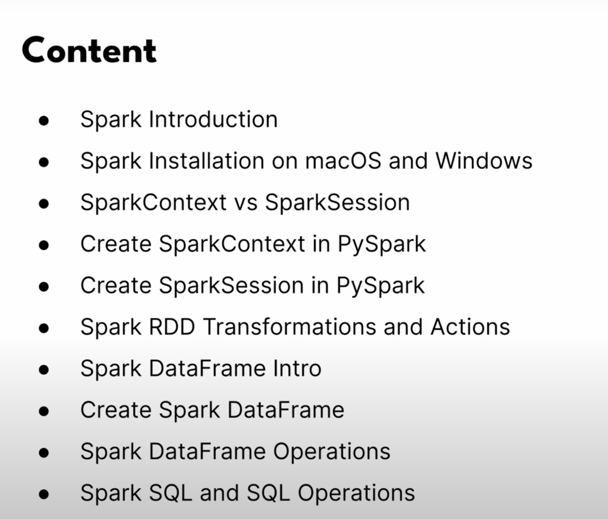
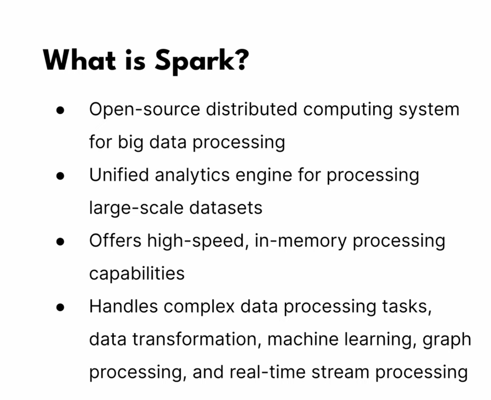
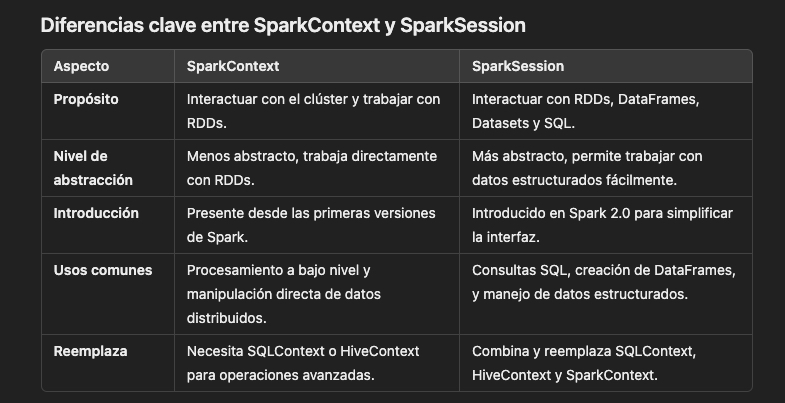
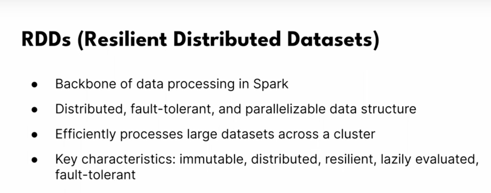
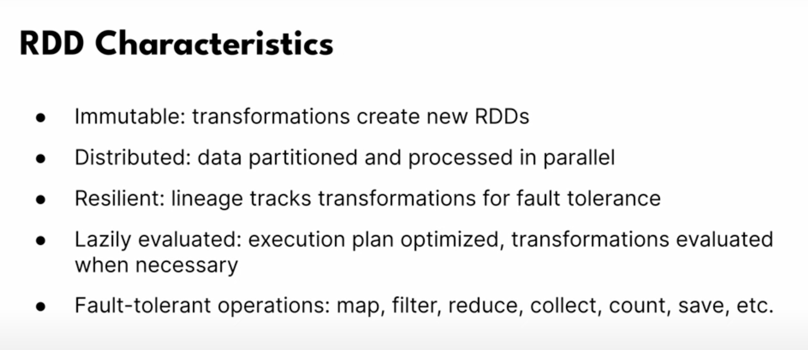
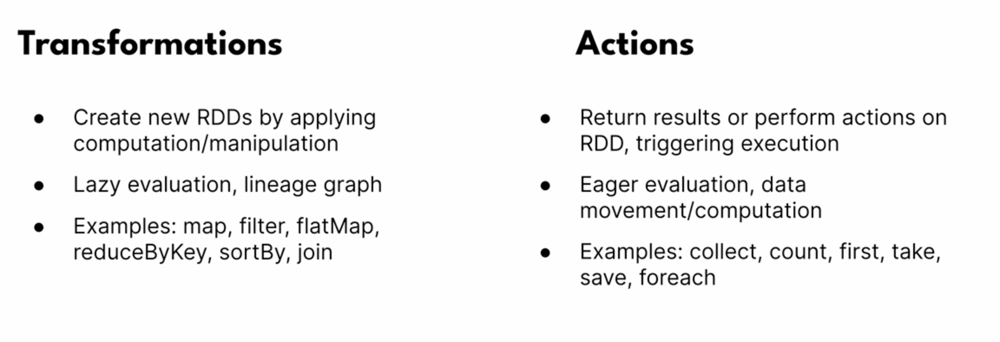
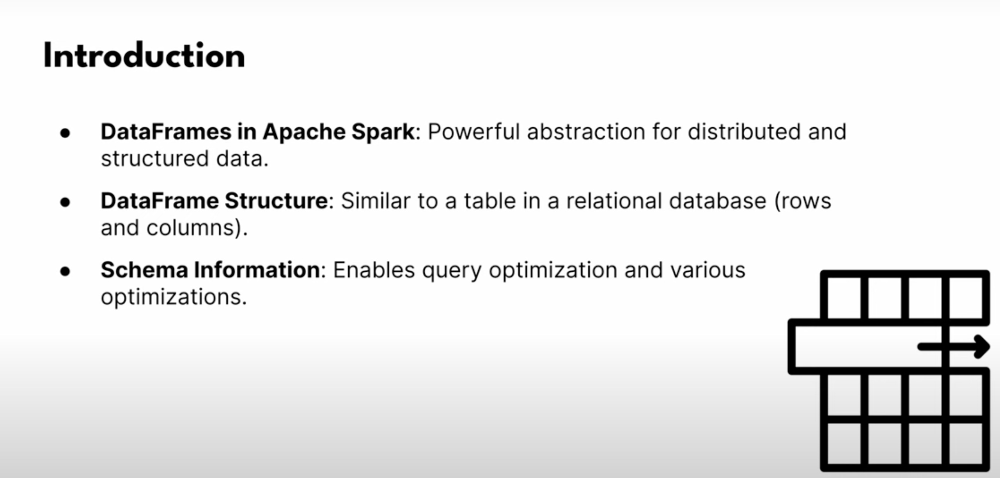
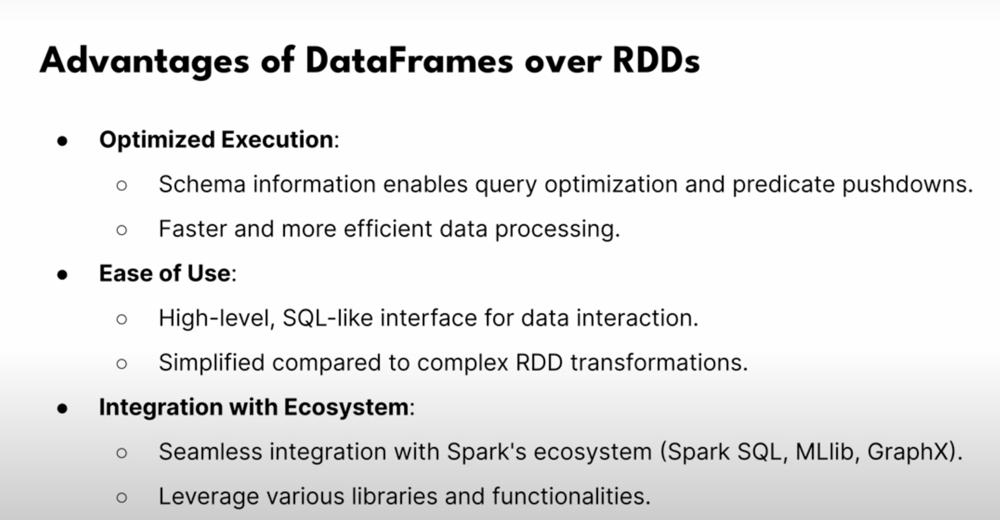
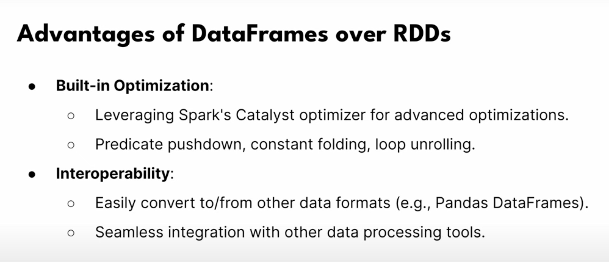

# coder2j-pyspark-tutorial
1. [Intro](#schema1)
2. [PySpark Install and Setup with JupyterLab](#schema2)
3. [SparkContext vs SparkSession](#schema3)
4. [Spark RDD and RDD Operations](#schema4)
5. [Spark DataFrame Intro](#schema5)
6. [Creating DataFrame from Various Data Sources](#schema6)
7. [Spark DataFrame Operations](#schema7)
8. [Spark-SQL](#schema8)

[Resources](#schemaref)

<hr>
<a name='schema1'></a>

## 1. Intro




<hr>
<a name='schema2'></a>

## 2. PySpark Install and Setup with JupyterLab

1. Install Java Development Kit (JDK), spark run on java 8, 11, or 17
    - https://www.oracle.com/java/technologies/downloads/#jdk21-mac

2. Install Apache Spark
    - https://spark.apache.org/downloads.html

3. Install Python

4. Create env
    ``` bash
    python3 -m venv nombre_del_entorno
    ```
5. Activate
    ``` bash
    source pyspark-env/bin/activate
    ```
6. Install Pyspark and jupyterlab
    ```
    pip install pyspark
    
    pip install findspark

    pip install jupyterlab
    ```
`findspark` es una herramienta útil cuando trabajas con PySpark en entornos de desarrollo como Jupyter Notebook o directamente en Python, ya que simplifica la configuración inicial de Spark. Aquí te explico su función:

- ¿Para qué se usa findspark?
Configuración del entorno Spark: findspark facilita la localización de la instalación de Spark y agrega automáticamente las rutas necesarias a las variables de entorno de Python, como SPARK_HOME y PYTHONPATH. Esto asegura que PySpark pueda encontrar los archivos y bibliotecas necesarios para ejecutarse correctamente.

- Uso en notebooks: Al trabajar en entornos como Jupyter Notebook, findspark permite que el notebook detecte la instalación de Spark sin necesidad de configuraciones complejas. Esto es especialmente útil si Spark no se ha instalado en rutas estándar o si se está ejecutando en un entorno donde los paquetes no están configurados globalmente.

- Simplificación de la inicialización: Con findspark, puedes simplemente importar e inicializar PySpark sin tener que realizar configuraciones manuales en cada script. Esto es práctico para desarrolladores y data scientists, ya que evita posibles problemas de configuración y facilita la reproducción de entornos de Spark en distintas máquinas.


7. Launch JupyterLab and use PySpark
```
jupyter-lab
```
### **Code**
[PySpark-Get-Started](01-PySapk-Get-Started.ipynb)

<hr>
<a name='schema3'></a>

## 3. SparkContext vs SparkSession

- **¿Qué es un clúster de Spark?**
Un clúster de Spark es un conjunto de computadoras conectadas entre sí (también llamados nodos) que colaboran para ejecutar tareas de procesamiento de datos de forma distribuida y en paralelo
    - Nodo Maestro (Master): Este es el "cerebro" del clúster. El nodo maestro coordina las tareas y asigna los recursos (como la memoria y el poder de procesamiento) entre los nodos trabajadores. Solo hay un nodo maestro en cada clúster.
    - Nodos Trabajadores (Workers): Son los nodos que realmente ejecutan el procesamiento de datos. Reciben instrucciones del nodo maestro y procesan partes de los datos en paralelo. Cuantos más nodos trabajadores haya, más rápido puede ejecutarse un trabajo, ya que cada nodo maneja una parte de los datos.
    - Aplicación: En un clúster de Spark, cada programa de Spark que se ejecuta es una aplicación que se despliega en el clúster y usa los recursos distribuidos para completar tareas de procesamiento de datos.

Aplicación de Spark → Crea SparkContext → Se conecta al clúster (Nodos maestro y trabajadores).
SparkContext coordina la distribución de datos y el procesamiento entre los nodos del clúster, permitiendo el procesamiento paralelo y distribuido.


### 1. SparkContext
- Definición: SparkContext es la entrada principal para la funcionalidad de Spark. Es la primera conexión entre una aplicación de Spark y el clúster de Spark, y representa la conexión a un contexto de Spark.
- Funciones principales:
    * Permite la creación de RDDs (Resilient Distributed Datasets), que es el nivel de abstracción más bajo en Spark para trabajar con datos distribuidos.
    - Controla la configuración y recursos del clúster de Spark, como el uso de nodos y la ejecución de tareas.

### 2. SparkSession
- Definición: Introducida en Spark 2.0, SparkSession es una capa superior de abstracción que facilita la creación y configuración de una aplicación de Spark, y combina toda la funcionalidad que antes estaba distribuida en SparkContext, SQLContext y HiveContext.
- Funciones principales:
    - Simplifica el uso de Spark, ya que es una interfaz unificada que permite interactuar tanto con RDDs como con DataFrames y Datasets (estructuras de datos optimizadas y organizadas).
    - Facilita el uso de Spark SQL, acceso a bases de datos, consultas SQL, y manejo de datos en formato estructurado.
    - Permite acceder al SparkContext a través de SparkSession.sparkContext, haciendo que el SparkContext esté siempre disponible cuando hay una sesión.




### **¿Cuál debo usar?**
- En general, SparkSession es la opción preferida en las versiones modernas de Spark (2.0 en adelante) porque ofrece una interfaz unificada y simplificada. Además, cubre la funcionalidad de SparkContext, por lo que SparkSession se utiliza para la mayoría de las aplicaciones.
- SparkContext es útil si necesitas trabajar directamente con RDDs sin las capas adicionales de abstracción, aunque normalmente puedes acceder a SparkContext desde SparkSession.


### Creating SparkContext in PySpark
### **Code**
[Create-SparkContext](./02-Create-SparkContext.ipynb)


### Creating SparkSession in Pyspark

### **Code**
[Create-SparkSession](03-Create-SparkSession.ipynb)


<hr>
<a name='schema4'></a>

## 4. Spark RDD and RDD Operations

Los `RDDs` (Resilient Distributed Datasets) son una de las principales abstracciones de datos en Apache Spark. Representan un conjunto de datos distribuido y tolerante a fallos que se puede procesar de manera paralela. Los RDDs son fundamentales en Spark, ya que permiten trabajar con datos de forma distribuida, escalable y eficiente.






### ¿Qué son los RDDs en PySpark?
En términos simples, un RDD es una colección de datos que se distribuye a través de varios nodos en un clúster y se puede procesar en paralelo. Cada RDD puede contener datos almacenados en múltiples particiones, las cuales pueden estar distribuidas a lo largo de los diferentes nodos del clúster de Spark.

### Características clave de los RDDs
- **Inmutabilidad**: Los RDDs son inmutables, lo que significa que una vez que se crean, no pueden ser modificados directamente. Sin embargo, puedes crear nuevos RDDs a partir de transformaciones de otros RDDs (por ejemplo, filtrar, mapear, etc.).

- **Distribución**: Los RDDs están diseñados para trabajar en un entorno distribuido, donde los datos se distribuyen automáticamente entre los nodos del clúster. Spark divide los RDDs en particiones para que cada nodo pueda trabajar de manera independiente y en paralelo.

- **Tolerancia a fallos**: Los RDDs son resilientes a fallos. Si un nodo del clúster falla, Spark puede recuperar los datos de un RDD desde otra parte del clúster utilizando un proceso llamado recuperación de fallos basado en el seguimiento de las transformaciones que se han realizado sobre los RDDs.

### Operaciones en RDDs:

- **Acciones**: Las acciones son operaciones que devuelven un valor o desencadenan el procesamiento de un RDD. Ejemplos: collect(), count(), save().
- **Transformaciones**: Son operaciones que crean un nuevo RDD a partir de uno existente. Son perezosas, lo que significa que no se ejecutan hasta que se realice una acción sobre el RDD. Ejemplos: map(), filter(), flatMap(), reduceByKey().

### **Code**
[RRD](./04-RDD-Operations.ipynb)

<hr>
<a name='schema5'></a>

## 5. Spark DataFrame Intro





### **Code**
[DataFrame - Intro](./05-DataFrame-Intro.ipynb)


<hr>
<a name='schema6'></a>

## 6. Creating DataFrame from Various Data Sources
```python
# Read CSV file into DataFrame with header
csv_file_path = "./data/products.csv"
df = spark.read.csv(csv_file_path,header=True)
```
```python
# Read CSV file into DataFrame with header
csv_file_path = "./data/products.csv"
df = spark.read.csv(csv_file_path,header=True)
```


```python
# Read CSV file into DataFrame with header
csv_file_path = "./data/products.csv"
df = spark.read.csv(csv_file_path,header=True, schema=df_schema)
```

```python
# Read CSV file into DataFrame with header
csv_file_path = "./data/products.csv"
df = spark.read.csv(csv_file_path,header=True, inferSchema=True)
```

```python
# Read single line JSON
# Each row is a JSON record, records aare separated by new line

json_file_path = "./data/products_singleline.json"
df=spark.read.json(json_file_path)
```


```python
# Read multi-line JSON
# Each row is a JSON record, records aare separated by new line

json_file_path = "./data/products_multiline.json"
df=spark.read.json(json_file_path, multiLine=True)
```
```python
# Read dataframe into parquet file
parquet_path = "./data/products.parquet"
df = spark.read.parquet(parquet_path)
```
### **Code**
[Creating DataFrame](./06-DataFrame-from-various-data-source.ipynb)

<hr>
<a name='schema7'></a>

## 7. Spark DataFrame Operations
### **Code**
[Spark DataFrame Operations](./07-DataFrame-Operations.ipynb)

<hr>
<a name='schema8'></a>

## 8. Spark-SQL

[Spark SQL](./img/sql.jpg)

[Spark SQL](./img/sql_2.jpg)


### **Code**
[Spark SQL](./08-Spark-SQL.ipynb)


<hr>
<a name='schemaref'></a>

## Resources

https://www.youtube.com/watch?v=EB8lfdxpirM

https://github.com/coder2j/pyspark-tutorial